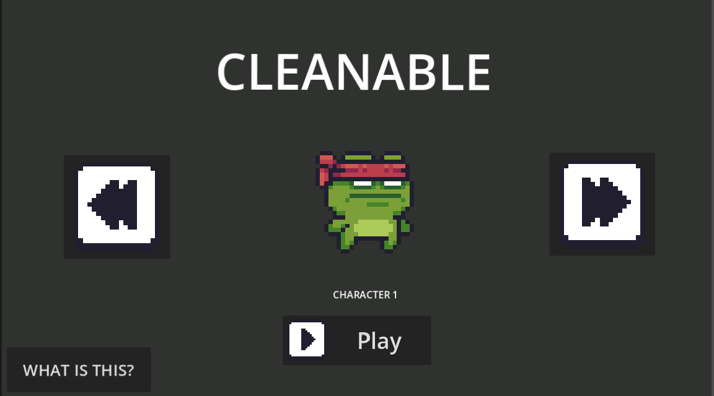

# Cleanable

My First Godot Game!

It is a 2D platform game where you control the hero who tries to go through the building and stay alive. Enemies, traps and some other obstacles prevent you from passing this level successfully.

The main idea of the game is that you should keep moving forward! Several enemies will follow you 💀

## Why did I create this game?

I've decided to create a Godot game to understand how to create a game in godot.

This is my first Godot game, so I didn't want to concentrate on creating only one thing but tried to explore a lot of features that can be used while creating this game

While making this game i learn how to use scenes, to create player, enemies, collisions, animations, camera, health system, game over screen, menus and many other interesting and useful features.

Some parts were more difficult than I thought but it was really cool to watch all the pieces of this game becoming whole. 😭

---

## Game controls

### Movement

- Left Arrow → move left
- Right Arrow → move right
- Space → gravity reverse
- Up Arrow → gravity goes up
- Down Arrow → gravity goes down

And you can select one of the three characters that are in the beginning menu.

You need to try and pass all the levels without getting killed and losing all the health.

There are 7 floors in total
There are some enemies on the map so try to be careful not to bump into anything lol.

---

## Home Screen

The game is set up from the beginning on a home screen where you can:

- Pick a character
- See the animation of the characters
- Start playing
- See the "What Is This?" screen

---

## Characters

There are 3 characters that you can play with.

You can change between them before you actually start the game.

Each character will have its own animations for idle and running.

---

## The World

The game includes a number of floors connected into one huge map.
There are various platforms, enemies, doors, hazards and other things in the world.

---

## Enemies

Enemies move in the levels trying to get to the player.

There are random spawns of enemies coming out of doors which you need to either avoid or get hurt.

In addition, I made sure that enemies don’t spawn all at once.

---
## Health

Your health is 100 points.

Hitting enemies reduces the health points.

Once you’re hit, you become invincible for a few seconds and will flash for some time.

Once the health reaches zero, you will move on to the Game Over screen.

---

## Doors

Doors serve as spawns for enemies.

Once doors are activated, enemies start spawning from there.

Afterward, the enemies roam around the level and not at the door anymore.

---

## Completing the game

There is a finish gate at the end of the final floor.
Once you touch the gloden trophy you'll get the finishing and redirected to Home Page.
then you can restart the Game.

---

Made With

- Godot

---

Assets

Some of the assets used in this project are taken from the Pixel Adventure 1 asset pack from Pixel Frog.

Asset Pack:
https://pixelfrog-assets.itch.io/pixel-adventure-1

Massive thanks to Pixel Frog for allowing the usage of their awesome assets!

And I've adjusted and rearranged the assets according to my style to make the levels and game.

---

Screenshots

Home Screen

---

About

By me as part of Hack Club Project.

This is my first game in Godot and I made this mostly for learning purposes rather than tutorial following.

Thank you for your time! ❤️
